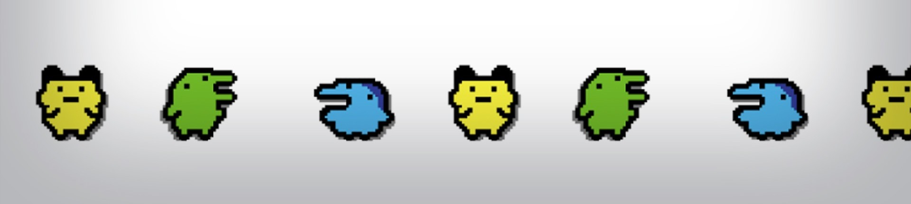
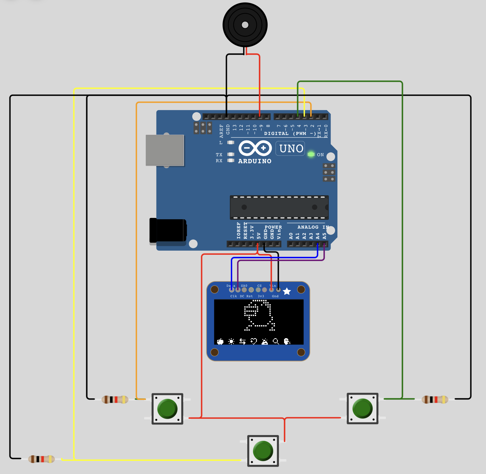
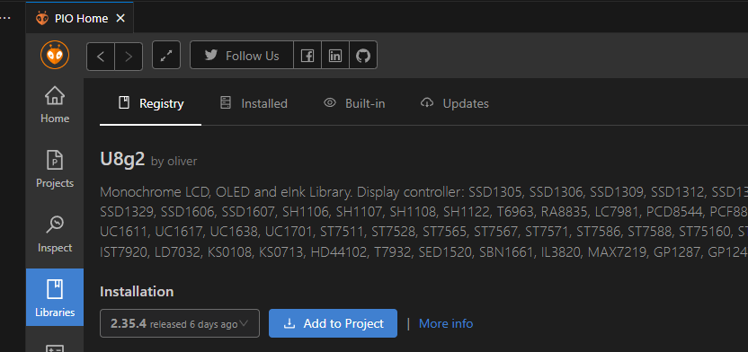

# Arduino Tamagotchi

- [Project Description](#project-description)
- [Hardware Requirements](#hardware-requirements)
- [Software Requirements](#software-requirements)
- [Installation Guide](#installation-guide)
  - [1) Install Git](#1-install-git)
  - [2) Install Java 8 Runtime](#2-install-java-8-runtime)
  - [3) Preparing the ROM file](#3-preparing-the-rom-file)
  - [4) Compose electronic parts](#4-compose-electronic-parts)
  - [5) Prepare and upload the code](#5-prepare-and-upload-the-code)
- [Usage](#usage)

---

# Project Description

By leveraging the codebase provided by [GaryZ88](https://github.com/GaryZ88/ArduinoGotchi), this project aims to build a classic Tamagotchi using an Arduino Uno.

# Hardware Requirements

- Arduino UNO
- 1K resistor x 3
- Push button x 3
- Buzzer
- SSD1306 I2C OLED 128x64

# Software Requirements

- [PlatformIO](https://platformio.org/)
- Tamagotchi P1 ROM (due to copyright issues this can’t be provided, however a quick Google search should suffice)
- Java 8 Runtime
- Git

# Installation Guide

Please note that this guide assumes you’re running Linux (whether natively or via WSL).

## 1) Install Git

```bash
sudo apt update
sudo apt upgrade
sudo apt install git
```

## 2) Install Java 8 Runtime

```bash
sudo apt install openjdk-8-jre-headless
```

## 3) Preparing the ROM file

Clone GaryZ88’s repository:

```bash
git clone https://github.com/GaryZ88/ArduinoGotchi
cd ArduinoGotchi
```

Next, put the `rom.bin` into the project folder (`/ArduinoGotchi/`). 

Your downloaded Rom might not be called `rom.bin`, but something else like `tama.b` for example. You can simply rename it to `rom.bin`. We won’t need the `test.b` that might be in your downloaded Rom folder.

Now run the following command to create a file called `rom_12bit.h`:

```bash
java TamaRomConvert rom.bin
```

## 4) Compose electronic parts

You can use the circuit diagram as reference:



## 5) Prepare and upload the code

Install U8g2 library via PlatformIO:



Open the `ArduinoGotchi.ino` file and upload the code to your Arduino Uno. You should be greeted by an egg, from which your new pet will soon hatch.


# Usage

Use the three installed buttons to navigate through the Tamagotchi menu to feed, pet and clean after your pet.

[demo.mp4](screenshots/demo.mp4)
